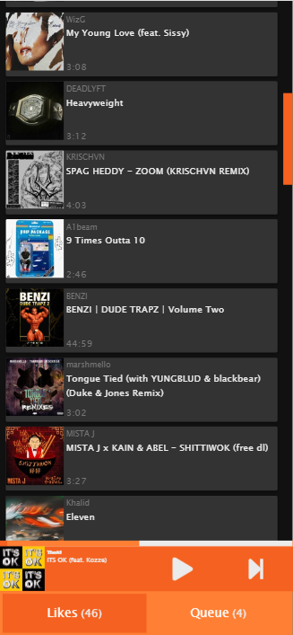
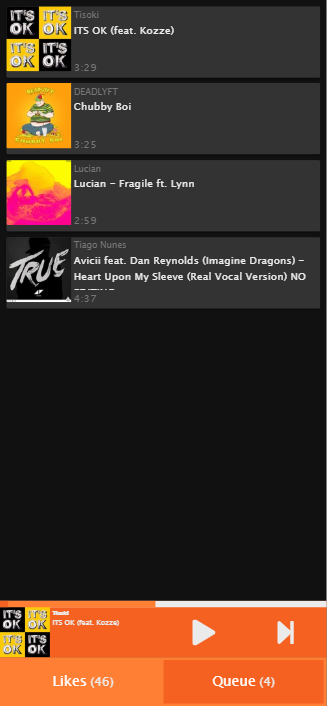

# Sound Queue

PWA SoundCloud 'clone' to implement some missing SoundCloud features  
Mainly the ability to queue songs on iOS devices
(I got tired of not being able to queue on mobile)

Allows for queueing and simple playback of SoundCloud songs

# Issues

Unfortunately, the official SoundCloud API is unusable without an existing registered App  
SoundCloud has cutoff app registration for the forseeable future, so I am unable to properly authenticate
in order to load premium songs

In addition to this, due to cross-origin resource sharing restrictions, the app currently only works if CORS is disabled for the browser being used.  
If the auth restrictions were not present I would look to circumvent this issue
